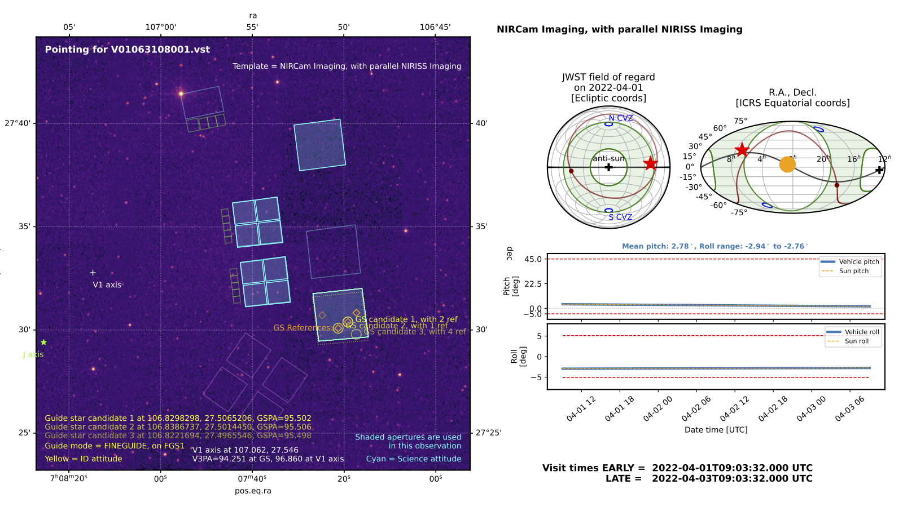

JWST Visit Viewer
--------------------------------------------------------------


This is a tool to display and visualize the pointings for JWST visit files,
such as are produced by OPGS based on APT files for upload to the observatory,
where they will be used by the OSS Executive to orchestrate observations.  The
main point of this tool is to make it easy to visualize where in the sky a
given visit will be pointed, the observatory attitude with respect to the sun
and the field of regard constraints, and which detector(s) will be used to take
data.

Astronomers planning observations with JWST are used to using APT Aladin to 
visualize the intended pointings on the sky of that observation. The purpose of this
tool is to make similar visualizations *working directly from the actual load files which
are sent to the observatory to command the observations*. These are derived from APT inputs
via data processing within PPS. 


**Caveats, warnings, and disclaimers:** This is an unofficial tool provided on a best-effort basis.
Some coordinate transforms are somewhat simplified, and not precisely correct in all details, but
are sufficient for the intended display/visualization purposes.
The exact position of JWST in its orbit around L2 is not tracked with high precision since that
is not needed for these plots.
 A difference in the assumed ephemeris for JWST can result in inconsistencies in
field of regard calculations. If this tool warns that a given visit may be out
of the field of regard, take that with a grain of salt for now, and check with
the real PPS experts for a more authoritative answer.


Currently, some aspects of sun pitch and yaw calculations are not working and
disabled, pending an update for compatibility with the changed API of
``jwst_gtvt`` versions greater than 1. Other aspects of plotting and
functionality still work fine.


Example Output
--------------

```>> visitviewer V01063108001.vst```



Installation
------------

**Basic Installation**:

Install this repo:

    pip install git+https://github.com/spacetelescope/jwst_visit_viewer.git


**Requirements:**
- numpy, astropy, matplotlib, etc
- pysiaf: https://github.com/spacetelescope/pysiaf
- jwst_gtvt: https://github.com/spacetelescope/jwst_gtvt


Usage Instructions
-------------------------------------------------

See [this notebook](https://github.com/spacetelescope/jwst_visit_viewer/blob/master/docs/Visit%20Viewer%20Docs%20and%20Usage.ipynb) in the Docs directory.


Contributing Code, Documentation, or Feedback
---------------------------------------------

See [CONTRIBUTING.md](CONTRIBUTING.md)

License
-------

BSD. See [LICENSE.md](LICENSE.md)
